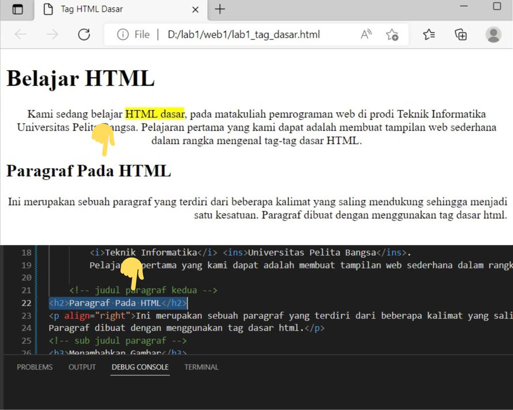

# Lab1-Web1
## Risyad Bima Nugraha
## 312110039
## TI.21.B1

1. Proses Pertama Membuat file baru di VSCode dan menambahkan  judul "Tag Dasar HTML" 

2. Membuat Judul Paragraf Pertama "Belajar HTML"

3. Membuat Paragraf Pertama

4. Membuat Format teks dengan tag '<mark>'

5. Membuat Format teks dengan tag '<b>'

6. Membuat Format teks dengan tag '<i>'

7. Membuat Format teks dengan tag '<ins>'

8. Membuat Judul Paragraf ke2

9. Membuat Paragraf ke2

10. Menambahkan Gambar/Logo Universitas Pelita Bangsa

11. Menambahkan Hyperlink

